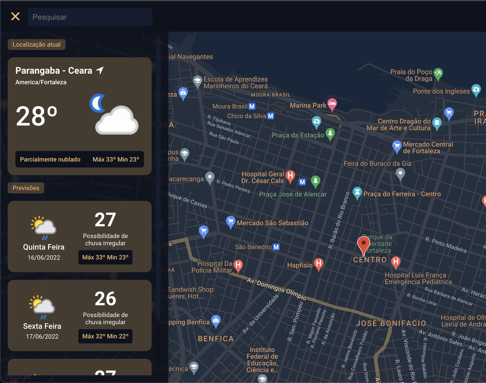

# Weather App




> Uma aplicação web onde o usuário consegue visualizar as informações do clima de determinada localização. O usuário deverá ver sempre as informações do dia atual e dos próximos dias.

## 💻 Pré-requisitos

Antes de começar, verifique se você atendeu aos seguintes requisitos:

- Você instalou a versão mais recente do `NodeJS`
- Yarn (Opcional)
- Possui uma conta em https://console.cloud.google.com para obter uma KEY de acesso para ultilizar o mapa.
- Possui uma conta em https://www.weatherapi.com/docs/ para obter uma KEY de acesso para ultilizar a API de clima.

## 🚀 Instalando <nome_do_projeto>

Para instalar o Wather App, siga estas etapas:

Terminal:

```
git clone https://github.com/edson-dantass/wather-app.git

```

Entre na pasta do projeto e instale as dependências:

```
npm install

```

## ☕ Usando Wather App

Para usar Wather App, siga estas etapas:

- Cole a KEY da api de Mapas no arquivo `.env` em `REACT_APP_GOOGLE_MAP_KEY`
- Cole a KEY da api de Tempo no arquivo `.env` em `REACT_APP_WATHER_KEY`

> ⚠️ Use o arquivo `.env.example` como exemplo.

Execute o camando

```
npm start
```

## 🤝 Colaboradores

Agradecemos às seguintes pessoas que contribuíram para este projeto:

<table>
  <tr>
    <td align="center">
      <a href="https://github.com/edson-dantass">
        <br>
        <sub>
          <b>Edson Dantas</b>
        </sub>
      </a>
    </td>
    <td align="center">
      <a href="https://github.com/adaltojunior86">
        <br>
        <sub>
          <b>Adalto Junior</b>
        </sub>
      </a>
    </td>
  </tr>
</table>

[⬆ Voltar ao topo](#nome-do-projeto)<br>
